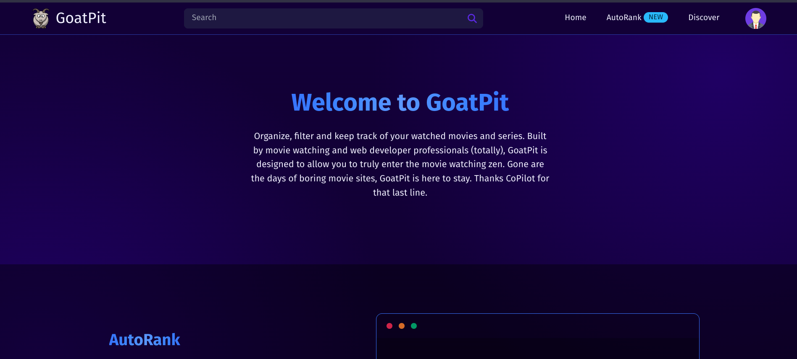

# GoatPit
WIP website for organizing and ranking your watched movies. Made primarily because I wanted to learn component based frontend with sveltekit, typescript, tailwind and kysely.

https://goat-pit.vercel.app


# Prerequisites
- node
- docker (for now)

You also need to configure a sendgrid account and a google account.


# How to configure
1. Clone this repo and cd into it.
2. Create a `.env` file in the root directory and set the following env variables:
```js
SENDGRID_API_KEY=""      // The sendgrid api key
SENDGRID_SENDER=""       // The sendgrid sender email address
JWT_SECRET=""            // A random string to use for verifying jwt tokens (can be whatever you want)
DOMAIN=""                // The domain (when testing set it to "127.0.0.1:5173")
GOOGLE_CLIENT_ID=""      // Your google client id
GOOGLE_CLIENT_SECRET=""  // Your google secret
```
3. Run the dev server with `make dev`


# Preview

## Landing page


## Autorank
